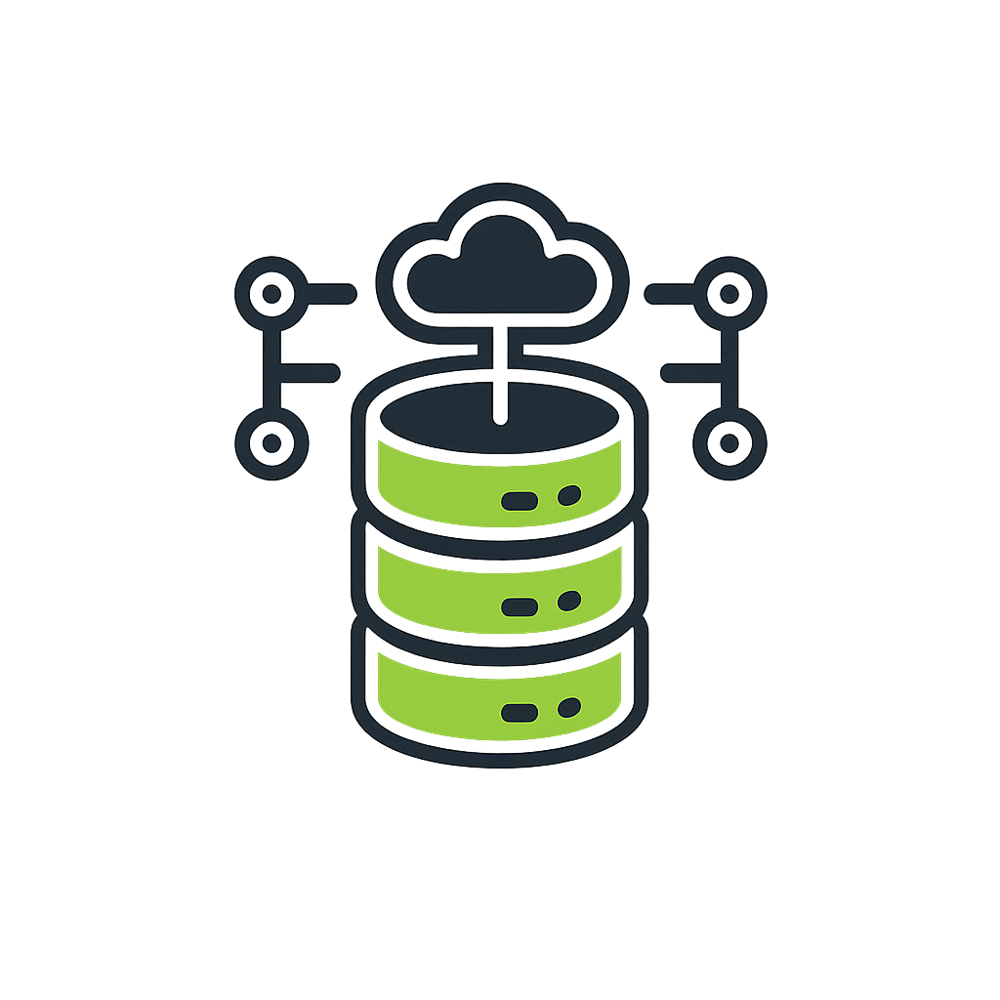

[License Button]: https://img.shields.io/badge/License-Apache_2.0-green
[License Link]: https://github.com/BackupBotlol/BackupBot/blob/main/LICENSE 'Apache 2.0 License.'




# BackupBot
[![License Button]][License Link]
[](https://discord.gg/Xnh5ckQVyV)

BackupBot is a Discord bot that automatically backs up your server’s data, roles, emojis, stickers, and a lot more

---

## Features

- Scheduled Backups: Automatic backups at hourly, daily, weekly, monthly, or even yearly
- Time Zones: Per-server timezone configuration for scheduling
- Component Selectio: Pick exactly what and what not to back up:
  - Server assets (name, icon, banner, discovery splash)  
  - Channels (Channel names and thier directories)
  - Roles (Role names, settings, permissions)  
  - Role icons
  - Emojis  
  - Stickers  
- Backup Storage: Upload archives to Cloudflare R2 using boto3, generates URLs for download
- ZIP Archiving: Backups saved as ZIP, option to split components into separate ZIP files
- Control: Run immediate backups and toggle the scheduler on or off
- Persistent Configuration: Server settings persisted in an SQLite database
- Help & Ping: `/help` for a command overview (English/Arabic), `/ping` to check latency

---

## What to Install

### Installing Git

**Windows:**
1. Download the Git installer from [git-scm.com](https://git-scm.com/download/win)
2. Run the installer and follow the prompts
- Note: make sure to install it in PATH

**macOS:**
1. Install using Homebrew:
   ```
   brew install git
   ```
- Or download the installer from [git-scm.com](https://git-scm.com/download/mac)

**Linux (Ubuntu/Debian):**
```
sudo apt update
sudo apt install git
```

### Installing Python

**Windows:**
1. Download the latest Python installer from [python.org](https://www.python.org/downloads/)
2. Run the installer
- Note: make sure to install it in PATH

**macOS:**
1. Install using Homebrew:
   ```
   brew install python
   ```
- Or download from [python.org](https://www.python.org/downloads/)

**Linux (Ubuntu/Debian):**
```
sudo apt update
sudo apt install python3 python3-pip
```

---

## How to Set Up the Bot

1. Clone this repo:
   ```
   git clone https://github.com/BackupBotlol/BackupBot.git
   cd BackupBot
   ```
3. Install the required packages (`pip install -r requirements.txt`)

4. Configure the .env file:

   - edit the `.env` file in the project root with the required credentials

5. Run the bot with `python bot.py`

---

## Requirements

- Python 3.8 and up
- Required python packages (`requirements.txt`)
- Cloudflare R2

---

## Usage

| Command | Description |
|---------|-------------|
| `/help [language]` | Show help in English or Arabic |
| `/addserver <log_channel> [timezone] [frequency]` | Add this server to the backup list, set the log channel, timezone, and frequency |
| `/changetimezone <timezone>` | Change the server’s backup timezone (example, `UTC`) |
| `/changefrequency <frequency>` | Change backup time (`hourly`, `daily`, `weekly`, `monthly`, `yearly`) |
| `/configurebackupcomponents [options]` | Toggle components (`server_assets`, `channels`, `roles`, `role_icons`, `emojis`, `stickers`) |
| `/separatefiles <true/false>` | Save each component in its own ZIP file |
| `/activate` | Activate the scheduler and run an immediate backup |
| `/deactivate` | Deactivate the backup scheduler |
| `/status` | Check whether the scheduler is active and view the next scheduled backup time |
| `/removeserver` | Remove this server from the backup list |
| `/ping` | Test the bot’s latency |
